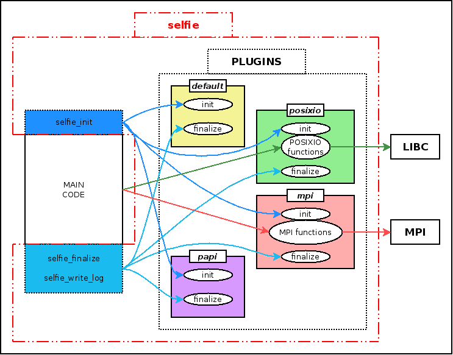

# selFIe                                                                        

**selFIe** (SElf and Light proFIling Engine) is a tool to lightly profile Linux commands without compiling.

selFIe is a dynamic library which can be given to the LD_PRELOAD environment variable before the execution of the command.

```
$ LD_PRELOAD=selfie.so hostname
myhost
```
It doesn't affect the behaviour of the command and users don't see any changes at execution. At the end of the execution, it puts a line in system logs:
```
selfie[26058]: { "utime": 0.00, "stime": 0.01, "maxmem": 0.00, "posixio_time": 0.00, "posixio_count": 7569, "USER": "user", "wtime": 0.01, "command": "/bin/hostname" }
```
The log line is in JSON format for post-processing (like ELK for example).

selFIe can be compiled to profile other features:
* MPI calls (Only C API)
* [PAPI](http://icl.cs.utk.edu/papi/overview/) hardware counters 

## Download

Official release can be downloaded in the [release page](https://github.com/cea-hpc/selFIe/releases).

To use development version:
```
$ git clone https://github.com/cea-hpc/selFIe.git
$ cd selFIe
$ ./autogen.sh
```

## Installation

### Prerequisites

* C and C++ compiler
* [libYAML](http://pyyaml.org/wiki/LibYAML)
* Python

selFIe has been tested on GNU/Linux only

Optional:
* PAPI library

### Compilation

```
$ ./configure --prefix=<path-to-install> --with-libyaml=<path-to-libyaml> --with-posixio 
$ make                                  
$ make install                          
```                                     
To compile with MPI and PAPI profiling:
```
$ ./configure --prefix=<path-to-install> --with-libyaml=<path-to-libyaml> --with-posixio --with-mpi --with-mpiio --with-papi=<path-to-papi>
$ make                                  
$ make install                          
```                                     

## Profiling
To profile your code with selFIe, you only have to add *selfie.so* to the LD_PRELOAD environment variable.
```
$ export LD_PRELOAD=<path-to-install>/lib/selfie.so
$ hostname
myhost
$ mpirun -n 1 ./hello_world
Hello world!
$ grep selfie /var/log/syslog
selfie[26135]: { "utime": 0.01, "stime": 0.00, "maxmem": 0.00, "posixio_time": 0.00, "posixio_count": 7569, "papi_ipc": 0.50, "papi_mem_bw": 13.62, "mpi_time": 0.00, "mpi_count": 0, "mpiio_time": 0.00, "mpiio_count": 0, "USER": "user", "wtime": 0.01, "command": "/bin/hostname" }
selfie[26040]: { "utime": 0.02, "stime": 0.04, "maxmem": 0.01, "posixio_time": 0.04, "posixio_count": 8383, "papi_ipc": 0.93, "papi_mem_bw": 143.62, "mpi_time": 0.10, "mpi_count": 2, "mpi_version": 3.00, "mpi_libversion": "open mpi", "mpiio_time": 0.00, "mpiio_count": 0, "mpiio_version": 3.00, "mpiio_libversion": "open mpi", "USER": "user", "wtime": 0.10, "command": "./a.out" }
```
## Configuration
The behaviour of selFIe can be configured in the file *<path-to-install>/etc/selfie.conf*. The default configuration has the following settings:
```
env_vars:
- USER
- OMP_NUM_THREADS

time_limit: 5.0

exclude_commands:
- ^/bin/
- ^/sbin/
- ^/usr/libexec/
- ^/usr/bin/

```
This file is divided in three parts:
* env_vars: this section lists the environment variables you want to log along the profiling.
* time_limit: to avoid flooding system logs, selFIe can be configured to log only commands that lasts at least a time. By default, this time is 5 seconds.
* exclude_commands: to avoid flooding system logs, selFIe can be configured to not log some commands. The section lists the commands that will not generate logs in log facility. You can specify a regular expression. By default, selFIe doesn't not log commands located in directories /bin, /sbin, /usr/libexec and /usr/bin.

By setting the environment variable SELFIE_CONFIGFILE, you can specify another configuration file for selFIe.

```
$ export SELFIE_CONFIGFILE=${HOME}/myselfie.conf
```
For profiling MPI codes, you should add the following environment variable to track the MPI rank of MPI processus depending which MPI library you use:
* **SLURM_PROCID** when using SLURM for launching MPI jobs
* **OMPI_COMM_WORLD_RANK** for OpenMPI
* **PMI_RANK** for IntelMPI

If you want to put log in other place than syslog, you can set SELFIE_OUTPUTFILE with a filename:

```
$ export SELFIE_OUTPUTFILE=/tmp/selfie.out
$ LD_PRELOAD=selfie.so hostname
$ cat $SELFIE_OUTPUTFILE
{ "utime": 0.00, "stime": 0.01, "maxmem": 0.00, "posixio_time": 0.00, "posixio_count": 7569, "USER": "user", "timestamp": 1500000, "wtime": 0.01, "command": "/bin/hostname" }
```

## Contributing
## Authors
See the list of [AUTHORS](AUTHORS) who participated in this project.
## Contact

Laurent Nguyen - <laurent.nguyen@cea.fr>

## Website

[CEA-HPC](http://www-hpc.cea.fr/)

## Architecture



selFIe is based on two features:
* selFIe can execute some code before and after main program
* selFIe uses the LD_PRELOAD environment variable to hook POSIXIO or MPI calls

## License

Copyright 2015-2018 CEA/DAM/DIF<br />
<br />
selFIe is distributed under the CeCILL-C. See the included files <br />
Licence_CeCILL-C_V1-en.txt (English version) and <br />
Licence_CeCILL-C_V1-fr.txt (French version) or visit  <br />
http://www.cecill.info for details.

## Acknowledgments
